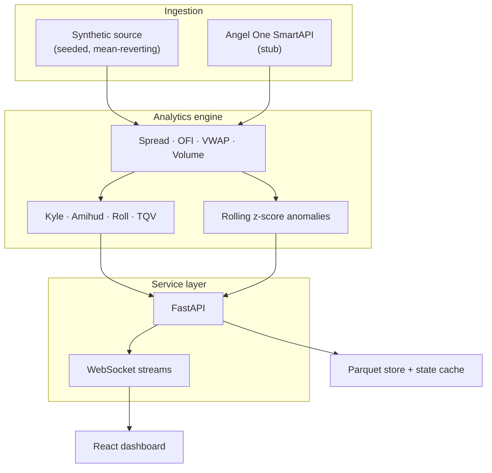

# Market Microstructure Analyzer

[](https://github.com/aariiparekh3012-collab/market-microstructure-analyzer/actions/workflows/ci.yml)
[](https://app.codacy.com/gh/aariiparekh3012-collab/market-microstructure-analyzer/dashboard)
[](https://app.codacy.com/gh/aariiparekh3012-collab/market-microstructure-analyzer/dashboard)
[](https://sonarcloud.io/dashboard?id=aariiparekh3012-collab_market-microstructure-analyzer)
[](https://sonarcloud.io/dashboard?id=aariiparekh3012-collab_market-microstructure-analyzer)
[](https://www.python.org/)
[](LICENSE)
[](https://doi.org/10.5281/zenodo.22057358)

> **Badge maintenance note.** The Codacy and SonarCloud URLs above point at
> the current GitHub repo name. If the underlying Codacy / SonarCloud
> projects were originally registered under the old name (`quantproject2`),
> rename them on those dashboards or the badges will 404. Codacy's project
> UUID is stable, so the *image* will keep rendering; the *link* is what needs
> the rename.

A streaming market-microstructure engine for Indian equities: ingests
five-level order-book snapshots, computes nine classical microstructure
signals incrementally, and serves them over FastAPI and WebSockets to a React
dashboard. Includes a seeded synthetic feed, a reproducible profiler, an OFI
signal backtester, and a TWAP/VWAP execution simulator.

**Reproducible profile on a laptop** (Python 3.12, seed `42`, 15,000 ticks,
five symbols, all nine modules enabled):

| Metric | Value |
|---|---|
| Per-tick latency (P50 / P95 / P99) | **65.0 µs / 132.5 µs / 313.3 µs** |
| Sustained throughput | **~12,400 ticks/sec** |
| Test suite | 16 tests, passing in 6.82 s |

Numbers are in-process computation only, not exchange-to-screen. Rerun with
`python run_profiler.py --ticks 15000 --seed 42`.

**Scope.** The synthetic feed, analytics engine, profiler, backtester,
execution simulator, API, dashboard, and CI are implemented and covered by
tests. The Angel One SmartAPI ingestion adapter is an explicit stub — the
system is intentionally shipped without a live feed until the reconnect,
sequence-gap, and rate-limit paths are validated. See
[`docs/VALIDATION.md`](docs/VALIDATION.md) for the current validation
boundary.

---

## Analytics

Nine estimators, all streaming and incremental:

| Module | Signal | Reference | File |
|---|---|---|---|
| Spread | Quoted, relative, depth-weighted (L1–L5) | — | `spread.py` |
| Order-flow imbalance | Event-level OFI, 60 s / 300 s / 900 s windows | Cont, Kukanov, Stoikov (2014) | `order_flow.py` |
| Kyle's λ | Rolling OLS of Δp on signed flow, with R² and t-stat | Kyle (1985) | `kyle_lambda.py` |
| Amihud illiquidity | Rolling \|r\| / traded value | Amihud (2002) | `amihud.py` |
| Roll's spread | Effective spread from serial covariance of Δp | Roll (1984) | `roll_spread.py` |
| Trade/quote variance | Single-venue diagnostic (see note below) | Hasbrouck (1991) | `hasbrouck.py` |
| Session VWAP | Online VWAP + volume-weighted deviation bands | — | `vwap.py` |
| Volume profile | Tick-rule classification, price-bucketed, cumulative delta | — | `volume.py` |
| Anomaly detection | Rolling z-scores on spread, volume, OFI | — | `anomaly_detector.py` |

The OFI implementation follows the event-level construction from
Cont–Kukanov–Stoikov, aggregated across three rolling horizons using
per-window deques and running sums (O(1) amortised per tick, not O(n) rescans).

> **Note on `hasbrouck.py`.** The module is a descriptive trade/quote-return
> variance diagnostic, **not** a Hasbrouck information-share estimator.
> Classical information share requires cointegrated multi-venue price series
> and a VECM innovation decomposition; this repository is single-venue. The
> name reflects the inspiration, and the docstring reflects the actual output.

---

## Quick start

**Prerequisites:** Python 3.11+, Node 18+ (only for the dashboard).

### Backend

```bash
git clone https://github.com/aariiparekh3012-collab/market-microstructure-analyzer.git
cd market-microstructure-analyzer

python -m venv .venv && source .venv/bin/activate     # or .venv\Scripts\Activate.ps1
pip install -r requirements.txt
cp .env.example .env
uvicorn backend.api.main:app --reload
```

API on `http://localhost:8000`. Three WebSocket channels:

```
/ws/orderbook/{symbol}
/ws/analytics/{symbol}
/ws/alerts
```

### Dashboard

```bash
cd frontend && npm install && npm run dev
```

Open `http://localhost:5173` — top-of-book, five-level depth, price vs VWAP,
OFI, cumulative signed volume, and live alerts, per symbol.

### Reproducible research workflow

```bash
python scripts/generate_sample_data.py --ticks-per-symbol 1000 --seed 42
python run_backtest.py            # OFI z-score strategy, 80 trades, PnL=125.89
python run_execution_sim.py       # TWAP vs replay-VWAP, slippage & IS
python run_profiler.py --ticks 15000 --seed 42
```

Same seed, same clock, same numbers.

### Offline demo (no backend, no data feed)

Open `demo/index.html`. Self-contained replay of RELIANCE, TCS, HDFCBANK,
INFY, ICICIBANK with five-level depth, price/VWAP/spread/OFI charts, and
1×–10× replay speed.

---

## Architecture



Each snapshot is normalised, threaded through the stateful analytics
modules (rolling windows, online aggregates), and fanned out over three
logical WebSocket topics.

---

## Research and simulation

**Notebooks** (`notebooks/`):
- `microstructure_analysis.ipynb` — return distributions, spreads, OFI, VWAP,
  volume profiles, cross-signal correlations, OFI autocorrelation.
- `latency_report.ipynb` — per-module latency distributions, time trends,
  per-symbol variation.

**OFI signal backtester** — parameterised directional z-score strategy
(entry/exit thresholds, lookback, per-trade cost in bps, position size,
initial capital). Reports trade-level P&L, unannualised trade-return ratio,
max drawdown, profit factor, win rate.

> Backtest P&L on synthetic data validates the pipeline end-to-end. It is
> not evidence of a deployable edge and is not annualised, on purpose.

**Execution simulator** — TWAP vs an ex-post replay VWAP schedule, walking
five-level book depth per child order. Reports arrival slippage, VWAP
slippage, implementation shortfall, last-fill slippage. Last-fill slippage
is not causal impact; the replay is book-static.

**Stress test** — concurrent WebSocket clients:
```bash
python tests/stress_test.py --clients 50 --duration 15
```

---

## Deployment

The stack ships as three containers wired together in `docker-compose.yml`:
FastAPI backend, Redis for the latest-snapshot cache, and an nginx-served
build of the React dashboard that reverse-proxies `/api`, `/ws`, `/healthz`,
and `/metrics` to the backend.

```bash
docker compose up --build
# dashboard  → http://localhost:8080
# API health → http://localhost:8000/healthz
# metrics    → http://localhost:8000/metrics
```

The backend image is multi-stage, runs as a non-root user, defines a
container-level `HEALTHCHECK`, and reads all tunables from environment
variables — see [`.env.example`](.env.example) for the full list
(`DATA_SOURCE`, `SYMBOLS`, `CORS_ALLOW_ORIGINS`, `LOG_JSON`, `LOG_LEVEL`,
`REDIS_URL`, `TICK_STORE_DIR`, `PARQUET_ROLL_MINUTES`).

### Operational endpoints

| Endpoint | Purpose |
|---|---|
| `GET /healthz` | Liveness + readiness. Returns **503** when the ingestion task is dead or ticks have been stale for more than 30 s. Wire this to your orchestrator's health probe. |
| `GET /metrics` | Prometheus text-format counters and gauges: `mma_ticks_ingested_total`, `mma_source_restarts_total`, `mma_last_tick_lag_seconds`, `mma_ws_clients{topic=…}`, `mma_messages_dropped_total{topic=…}`, `mma_anomalies_emitted_total`, `mma_ticks_persist_failed_total`. |

### Resilience properties

- **Source reconnect.** If the data source raises, the streamer backs off
  exponentially (1 s → 60 s cap) and reconnects instead of crashing the API.
  Restart count is exposed as `mma_source_restarts_total`.
- **Backpressure.** WebSocket subscriber queues are bounded at 200 messages.
  Full queues drop the oldest message and increment
  `mma_messages_dropped_total{topic=…}` — silent-suppress is gone.
- **Tick storage is off-loop.** `TickStore.append` runs on a thread pool via
  `asyncio.to_thread`, so a slow disk never blocks the event loop and never
  starves WebSocket clients. A single `ParquetWriter` is kept open per
  time-bucket — no more read-then-rewrite of the whole file on every flush.
- **Bounded state.** `recent_alerts` is a `deque(maxlen=500)` — O(1) append,
  not the previous O(n) list-slice at every push past the limit.

### Auth & rate limiting

* **WebSocket auth.** Set `WS_AUTH_TOKEN` to a long random string; clients
  pass it as `?token=…` on the WebSocket URL. Auth is compared in constant
  time and unauthenticated sockets are closed with WS code `4401` before
  any subscription is registered. Leaving `WS_AUTH_TOKEN` empty disables
  the check (dev only — the server logs a warning on startup).
* **HTTP rate limiting.** All `/api/*` endpoints share a fixed-window
  in-memory limiter keyed by client IP, defaulting to
  `HTTP_RATE_LIMIT_PER_MINUTE=120`. Exceeding the cap returns `429` with a
  `Retry-After` header. Set the limit to `0` to disable; for multi-worker
  deploys, prefer rate limiting at the reverse proxy — this counter is
  per-process.

Both are intentionally minimal. For anything internet-facing, front the
service with a real auth / DoS layer (an OAuth2 proxy, WAF, mTLS at the
edge) — the built-in checks are a floor, not a ceiling.

### Production checklist

Before turning this on for anything real:

- [ ] Set `CORS_ALLOW_ORIGINS` to the dashboard's actual origin (never `*`).
- [ ] Set `WS_AUTH_TOKEN` to a long random string.
- [ ] Set `LOG_JSON=1` so logs are shippable.
- [ ] Restrict `/metrics` at the reverse proxy to the monitoring subnet.
- [ ] Point `TICK_STORE_DIR` at durable storage (a mounted volume, EFS,
      etc.) — the compose file uses a named Docker volume by default.
- [ ] Complete the Angel One adapter's reconnect / gap-recovery / rate-limit
      paths before switching `DATA_SOURCE=angel`.

---

## Testing and reproducibility

```bash
pip install -r requirements-dev.txt
ruff check backend scripts run_*.py tests
pytest --cov=backend --cov-report=term-missing
```

CI (GitHub Actions) runs on every push and PR: lint, backend tests on
Python 3.11 and 3.12, coverage, sample-data generation, profiler smoke run,
and a production frontend build.

The synthetic feed uses a fixed clock and a local seeded RNG — a given
`(command, seed)` produces bit-identical snapshots, metrics, and anomalies
across machines.

---

## Project structure

```
market-microstructure-analyzer/
├── backend/
│   ├── analytics/          # 9 estimators + engine + profiler + backtester + execution_sim
│   ├── api/                # FastAPI app + WebSocket streamer
│   ├── ingestion/          # mock_source, angel_source (stub)
│   ├── storage/            # Parquet tick store + Redis state cache
│   └── tests/              # 16 tests: analytics, engine warm-up, reproducibility, API smoke
├── frontend/               # React + Vite dashboard
├── demo/                   # Self-contained offline replay
├── notebooks/              # Microstructure + latency analysis
├── scripts/                # Sample-data generator, historical fetcher
├── research/               # Signal research (OFI predictability) + theory PDF
├── docs/VALIDATION.md      # Reproducibility & validation boundary
└── run_{backtest,execution_sim,profiler}.py
```

---

## Scope and limitations

Explicit rather than buried — the same list a senior reviewer would derive on their own:

- **Data.** Five-level snapshots do not reconstruct every order event; tick-rule
  classification approximates trade sign and can misclassify on unchanged
  prices or out-of-sequence events.
- **Estimators.** Amihud and Kyle here are tick-level adaptations and are not
  directly comparable to bar-frequency estimates. Roll's estimator is only
  defined under its covariance condition. `hasbrouck.py` is a single-venue
  variance diagnostic, not the classical information-share estimator.
- **Execution.** The book is static in the replay — last-fill slippage is not
  causal market impact.
- **Live data.** The Angel One adapter is a stub. Reconnect, sequence-gap
  recovery, rate-limit handling, and structured logging are not yet in place,
  and there is no exchange-session control layer.
- **Trading.** No validated strategy, no live P&L, no out-of-sample study on
  real data. Synthetic-data backtests are a software test, not a market claim.

---

## Live-data integration (in progress)

`backend/ingestion/angel_source.py` is the Angel One SmartAPI skeleton. To
extend it locally:

1. Create SmartAPI credentials with Angel One.
2. Copy `.env.example` → `.env` and add credentials (never commit).
3. `DATA_SOURCE=angel`, restart the backend.
4. Complete the TODOs in `angel_source.py`.

Before using beyond local research, add reconnect logic, subscription recovery,
sequence and timestamp checks, rate-limit handling, structured logging, and
exchange-session controls.

---

## References

1. Cont, R., Kukanov, A., & Stoikov, S. (2014). *The Price Impact of Order
   Book Events.* Journal of Financial Econometrics, 12(1), 47–88.
2. Kyle, A. S. (1985). *Continuous Auctions and Insider Trading.*
   Econometrica, 53(6), 1315–1335.
3. Amihud, Y. (2002). *Illiquidity and Stock Returns: Cross-Section and
   Time-Series Effects.* Journal of Financial Markets, 5(1), 31–56.
4. Roll, R. (1984). *A Simple Implicit Measure of the Effective Bid-Ask
   Spread in an Efficient Market.* The Journal of Finance, 39(4), 1127–1139.
5. Hasbrouck, J. (1991). *Measuring the Information Content of Stock Trades.*
   The Journal of Finance, 46(1), 179–207.
6. Hasbrouck, J. (1995). *One Security, Many Markets: Determining the
   Contributions to Price Discovery.* The Journal of Finance, 50(4),
   1175–1199.

---

## Disclaimer

Research and educational use only. Not investment advice. Simulated
performance is not a forecast.

**Aarya Parekh** · IIT Bombay · 2026
