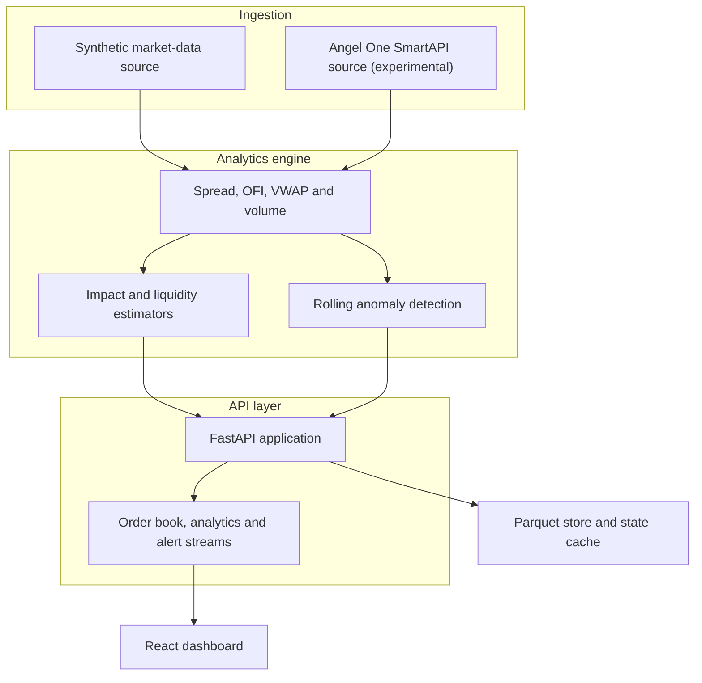

# Real-Time Market Microstructure Analyzer

A research-grade platform for computing, backtesting, and visualising market
microstructure signals for Indian equities.

The system consumes five-level order-book snapshots, calculates liquidity and
order-flow features, publishes analytics through FastAPI and WebSockets, and
displays them in a React dashboard. It includes a synthetic market-data source,
an offline replay demo, research notebooks, a signal backtester, execution
simulators, and load-testing utilities.

> **Project status:** The deterministic synthetic-data workflow, analytics
> engine, profiler, backtester, execution simulator, API, and dashboard are
> implemented. Backend tests, reproducibility smoke checks, and the frontend
> production build run in continuous integration. Angel One SmartAPI integration
> remains an explicit stub. The offline demo replays embedded data; it is not a
> live exchange feed.

> **Legacy report notice:** The included PDF reports predate the current repair
> and contain outdated implementation and benchmark statements. See
> [`docs/VALIDATION.md`](docs/VALIDATION.md) for the current validation boundary.

## Contents

- [Highlights](#highlights)
- [Quick start](#quick-start)
- [System architecture](#system-architecture)
- [Analytics](#analytics)
- [Dashboard and API](#dashboard-and-api)
- [Research and simulation](#research-and-simulation)
- [Testing and reproducibility](#testing-and-reproducibility)
- [Performance](#performance)
- [Live-data integration](#live-data-integration)
- [Project structure](#project-structure)
- [Methodological notes](#methodological-notes)
- [References](#references)

## Highlights

- Five-level order-book ingestion at a configurable tick rate
- 18 derived fields, plus identifiers and market fields, across nine modules
- Rolling order-flow, liquidity, price-impact, VWAP, and volume signals
- FastAPI endpoints and separate WebSocket streams for market data, analytics,
  and alerts
- React dashboard with symbol switching and live-updating charts
- Offline browser demo with embedded data for five NSE-listed equities
- OFI signal backtester with configurable transaction costs
- TWAP and VWAP execution simulation with order-book walking
- Research notebooks for signal analysis and latency profiling
- Concurrent WebSocket stress-testing utility

## Quick start

### Prerequisites

- Python 3.11 or later
- Node.js 18 or later, if running the React frontend

### 1. Start the backend

```bash
git clone https://github.com/aariiparekh3012-collab/quantproject2.git
cd quantproject2

python -m venv .venv
source .venv/bin/activate          # Linux or macOS
# .venv\Scripts\Activate.ps1       # Windows PowerShell

pip install -r requirements.txt
cp .env.example .env
uvicorn backend.api.main:app --reload
```

The API is then available at `http://localhost:8000`.

### 2. Start the dashboard

In a second terminal:

```bash
cd frontend
npm install
npm run dev
```

Open `http://localhost:5173`.

### 3. Exercise the research workflow

Generate deterministic sample data before running the backtester or execution
simulator:

```bash
python scripts/generate_sample_data.py --ticks-per-symbol 1000 --seed 42
python run_backtest.py
python run_execution_sim.py
python run_profiler.py --ticks 15000 --seed 42
```

Generated CSV and JSON files are excluded from Git because they can be
recreated from the recorded seed.

### 4. Run the offline demo

Open `demo/index.html` directly in a browser. The demo is self-contained and
does not require the Python backend or a brokerage connection.

It provides:

- RELIANCE, TCS, HDFCBANK, INFY, and ICICIBANK symbol tabs
- A five-level order book with quantity bars
- Price and VWAP, spread, OFI, and cumulative-delta charts
- Replay controls at 1x, 2x, 5x, and 10x speed

## System architecture



At a high level, each incoming snapshot is normalised, passed through the
analytics engine, and published to downstream consumers. Stateful modules keep
rolling windows or online aggregates between updates.

## Analytics

| Module | Output | Implementation |
| --- | --- | --- |
| Spread analytics | Quoted, relative, and depth-weighted spread | `backend/analytics/spread.py` |
| Order-flow imbalance | Event-level OFI aggregated over 60 s, 300 s, and 900 s windows | `backend/analytics/order_flow.py` |
| Kyle's lambda | Rolling price-impact coefficient, R², and t-statistic | `backend/analytics/kyle_lambda.py` |
| Amihud illiquidity | Rolling absolute return per unit of traded value | `backend/analytics/amihud.py` |
| Roll spread | Implied spread derived from serial covariance in price changes | `backend/analytics/roll_spread.py` |
| Trade/quote variance diagnostic | Descriptive single-venue trade-return and quote-return variance shares | `backend/analytics/hasbrouck.py` |
| Session VWAP | Online VWAP and volume-weighted deviation bands | `backend/analytics/vwap.py` |
| Volume analytics | Tick-rule classification, price-bucketed volume, and cumulative delta | `backend/analytics/volume.py` |
| Anomaly detection | Rolling z-scores for spread, volume, and OFI | `backend/analytics/anomaly_detector.py` |

### Spread analytics

The spread module calculates the best-quote spread, its midprice-relative
equivalent, and a depth-weighted measure using quantities across the five
available order-book levels.

### Order-flow imbalance

The OFI module implements the event-level construction described by Cont,
Kukanov, and Stoikov. Changes in best bid and ask prices and quantities produce
a signed flow contribution, which is then aggregated across several rolling
horizons.

### Price impact and liquidity

Kyle's lambda is estimated through rolling OLS of price changes on signed order
flow. Amihud's ratio provides a model-light complement based on absolute return
per unit of traded value. Roll's estimator infers an effective spread from
negative serial covariance in transaction-price changes.

### VWAP and volume

Session VWAP uses online running sums and resets on a trading-day boundary. The
volume module classifies trades using the tick rule, builds a price-bucketed
profile, and tracks cumulative signed volume.

### Anomaly detection

Spread, volume, and OFI are monitored with rolling z-scores. An alert is emitted
when a configured threshold is exceeded; the default threshold is three
standard deviations.

## Dashboard and API

The React dashboard subscribes to the backend WebSocket streams and renders:

- Top-of-book price and spread statistics
- Five levels of bid and ask depth
- Price relative to session VWAP
- Order-flow imbalance
- Cumulative signed volume
- Statistical alerts

The backend exposes three logical WebSocket channels:

```text
/ws/orderbook/{symbol}
/ws/analytics/{symbol}
/ws/alerts
```

See the FastAPI route definitions in `backend/api/main.py` for the current
message schemas and endpoint behaviour.

## Research and simulation

### Research notebooks

`notebooks/microstructure_analysis.ipynb` explores price behaviour, return
distributions, spreads, OFI, VWAP, volume profiles, anomalies, cross-metric
correlations, and OFI autocorrelation.

`notebooks/latency_report.ipynb` analyses total and per-module computation
latency, percentile distributions, time trends, and symbol-level variation.

Install the optional research dependencies and generate fresh data before
running the notebooks:

```bash
pip install -r requirements-research.txt
python scripts/generate_sample_data.py --ticks-per-symbol 1000 --seed 42
python run_profiler.py --ticks 15000 --seed 42
```

### OFI signal backtester

The backtester implements a configurable directional z-score strategy around
the OFI signal. Parameters include entry and exit thresholds, lookback window,
transaction costs, position size, and initial capital. Output includes
trade-level P&L, an unannualised trade-return ratio, maximum drawdown, profit
factor, and win rate.

```bash
python run_backtest.py
```

Backtest results produced from synthetic or replayed data are demonstrations of
the research pipeline, not evidence of a deployable trading edge.

### Execution simulator

The execution simulator compares TWAP and an ex-post replay VWAP schedule while
walking the available book levels for each child order. It reports arrival and
VWAP slippage, implementation shortfall, last-fill slippage, and fill quantities
across configurable order sizes. Because the replay VWAP schedule observes the
full window's volume, it is a diagnostic benchmark rather than a deployable
forecasting algorithm.

```bash
python run_execution_sim.py
```

### WebSocket stress test

The stress test opens concurrent WebSocket clients and measures connection
success, throughput, and first-message latency.

```bash
python tests/stress_test.py --clients 50 --duration 15
```

## Testing and reproducibility

Install the development dependencies and run the automated checks:

```bash
pip install -r requirements-dev.txt
ruff check backend scripts run_backtest.py run_execution_sim.py run_profiler.py tests
pytest --cov=backend --cov-report=term-missing
```

For a lockfile-based environment, install `uv` and run
`uv sync --locked --extra dev` instead of the first command.

GitHub Actions runs linting, backend tests on Python 3.11 and 3.12, coverage,
sample-data generation, a profiler smoke run, and a production frontend build
on every push and pull request.

The synthetic generator uses a fixed clock and a local seeded random-number
generator. The same command and seed therefore produce the same snapshots and
analytics records.

## Performance

Latency depends on hardware, Python version, enabled modules, symbol count,
window sizes, data source, storage configuration, and concurrent clients. For a
reproducible comparison, run:

```bash
python run_profiler.py --ticks 15000 --seed 42
```

The repository does not advertise a fixed latency number. When publishing a
result, record at least the processor, operating system, Python version, number
of symbols, number of ticks, seed, enabled modules, warm-up period, and
P50/P95/P99 latency. A profiler run measures computation in the current process;
it is not an exchange-to-screen latency measurement.

## Live-data integration

The repository includes an Angel One SmartAPI adapter in
`backend/ingestion/angel_source.py`. It is an experimental integration rather
than a completed production connector.

To work on the integration:

1. Create SmartAPI credentials through Angel One.
2. Copy `.env.example` to `.env` and add credentials locally.
3. Set `DATA_SOURCE=angel`.
4. Complete and test the remaining TODOs in `angel_source.py`.
5. Restart the backend.

Do not commit credentials. Before using the connector beyond local research,
add and validate reconnect logic, subscription recovery, sequence and timestamp
checks, rate-limit handling, structured logging, and exchange-session controls.

## Project structure

```text
quantproject2/
├── backend/
│   ├── analytics/
│   │   ├── amihud.py
│   │   ├── anomaly_detector.py
│   │   ├── backtester.py
│   │   ├── engine.py
│   │   ├── execution_sim.py
│   │   ├── hasbrouck.py
│   │   ├── kyle_lambda.py
│   │   ├── order_flow.py
│   │   ├── profiler.py
│   │   ├── roll_spread.py
│   │   ├── spread.py
│   │   ├── volume.py
│   │   └── vwap.py
│   ├── api/
│   │   ├── main.py
│   │   └── streamer.py
│   ├── ingestion/
│   │   ├── angel_source.py
│   │   └── mock_source.py
│   └── storage/
│       ├── state_cache.py
│       └── tick_store.py
├── demo/
│   └── index.html
├── frontend/
├── scripts/
│   ├── fetch_historical.py
│   └── generate_sample_data.py
├── notebooks/
│   ├── latency_report.ipynb
│   └── microstructure_analysis.ipynb
├── tests/
│   └── stress_test.py
├── run_backtest.py
├── run_execution_sim.py
├── run_profiler.py
├── requirements.txt
├── requirements-dev.txt
├── requirements-live.txt
└── requirements-research.txt
```

## Methodological notes

- Five-level snapshots do not by themselves reconstruct every market event.
  Trade classification and order-flow results depend on the fields and
  timestamps supplied by the selected data source.
- Tick-rule classification is an approximation and may misclassify trades when
  prices are unchanged or events arrive out of sequence.
- Roll's spread is only defined under its covariance condition. The
  implementation's treatment of non-negative covariance should be documented
  when reporting results.
- Rolling regressions and z-scores require a warm-up period. Early-window output
  should not be compared directly with fully populated windows.
- `hasbrouck.py` contains a descriptively named trade/quote variance diagnostic.
  It is not a Hasbrouck information-share estimator. Classical information share
  normally uses cointegrated price series across venues and a VECM innovation
  decomposition.
- The Amihud and Kyle calculations are tick-level adaptations. They should not
  be compared directly with estimates built at different sampling frequencies.
- Last-fill slippage in the execution simulator is not causal market impact;
  the replay does not alter subsequent book states in response to simulated
  orders.
- Synthetic-data backtests validate software behaviour, not market
  predictability. Any investment conclusion requires correctly licensed,
  timestamped historical data and out-of-sample testing.

## References

1. Cont, R., Kukanov, A., & Stoikov, S. (2014). *The Price Impact of Order Book
   Events.* Journal of Financial Econometrics, 12(1), 47–88.
2. Kyle, A. S. (1985). *Continuous Auctions and Insider Trading.* Econometrica,
   53(6), 1315–1335.
3. Amihud, Y. (2002). *Illiquidity and Stock Returns: Cross-Section and
   Time-Series Effects.* Journal of Financial Markets, 5(1), 31–56.
4. Roll, R. (1984). *A Simple Implicit Measure of the Effective Bid-Ask Spread
   in an Efficient Market.* The Journal of Finance, 39(4), 1127–1139.
5. Hasbrouck, J. (1991). *Measuring the Information Content of Stock Trades.*
   The Journal of Finance, 46(1), 179–207.
6. Hasbrouck, J. (1995). *One Security, Many Markets: Determining the
   Contributions to Price Discovery.* The Journal of Finance, 50(4),
   1175–1199.

## Disclaimer

This repository is for research and educational use. It does not provide
investment advice, and its simulations, signals, and performance statistics do
not guarantee future trading results.

---

**Aarya Parekh** · IIT Bombay · 2026
